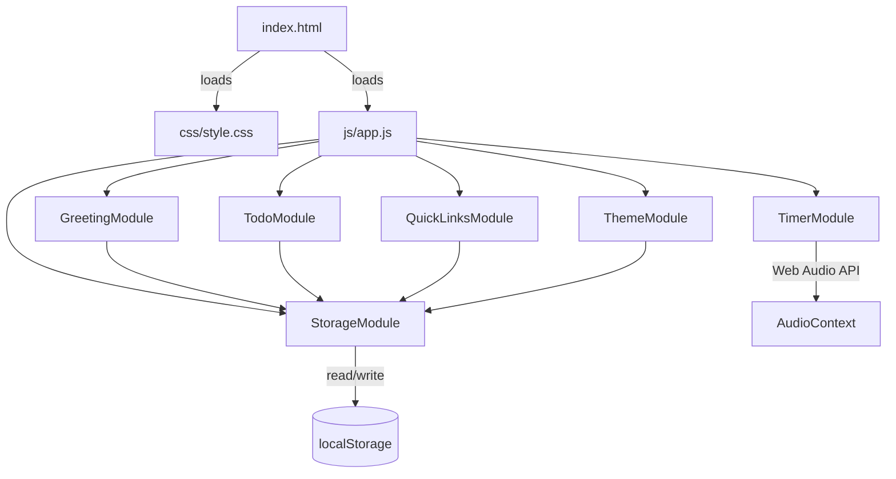
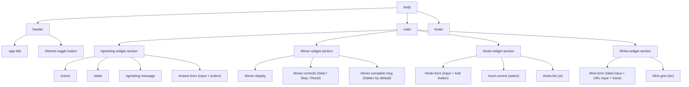

# Design Document: To-Do Life Dashboard

## Overview

The To-Do Life Dashboard is a single-page, client-side productivity application built with plain HTML, CSS, and Vanilla JavaScript — no frameworks, no build tools, no server. It combines five widgets (Greeting, Focus Timer, To-Do List, Quick Links, and Theme Toggle) into one cohesive page, persisting all state in `localStorage`. The architecture uses a module-like pattern inside a single `app.js` file: each feature is an IIFE-based or object-literal module with a clear public API, wired together by a thin `init()` bootstrap at the bottom of the file.

## File Structure

```
project-root/
├── index.html        ← single HTML entry point
├── css/
│   └── style.css     ← all styles (custom properties, layout, themes)
└── js/
    └── app.js        ← all JavaScript (module objects + bootstrap)
```

No other source files are required. Assets (e.g., a notification sound generated via the Web Audio API) are produced at runtime — no binary files needed.

## Architecture



All modules are initialised once by `App.init()` after `DOMContentLoaded`. Modules communicate only through the shared `StorageModule` — they do not call each other directly.

## HTML Layout (`index.html`)



Key HTML conventions:
- Theme is applied via a `data-theme` attribute on `<html>` (`data-theme="light"` or `data-theme="dark"`).
- All validation messages use `<span class="validation-msg" aria-live="polite">` placed immediately after the relevant input.
- Buttons that are disabled carry the native `disabled` attribute so they are also inaccessible to keyboard users when inactive.

## CSS Architecture (`css/style.css`)

### Custom Properties (Design Tokens)

```css
:root {
  /* colours — light theme defaults */
  --color-bg:          #f5f5f5;
  --color-surface:     #ffffff;
  --color-primary:     #4f46e5;
  --color-primary-hover: #4338ca;
  --color-text:        #1f2937;
  --color-text-muted:  #6b7280;
  --color-border:      #e5e7eb;
  --color-danger:      #ef4444;
  --color-success:     #22c55e;

  /* spacing */
  --space-xs: 0.25rem;
  --space-sm: 0.5rem;
  --space-md: 1rem;
  --space-lg: 1.5rem;
  --space-xl: 2rem;

  /* typography */
  --font-sans: system-ui, -apple-system, sans-serif;
  --font-mono: ui-monospace, monospace;
  --text-sm:   0.875rem;
  --text-base: 1rem;
  --text-lg:   1.25rem;
  --text-xl:   1.5rem;
  --text-2xl:  2rem;
  --text-4xl:  3.5rem;

  /* radii & shadows */
  --radius-sm: 0.25rem;
  --radius-md: 0.5rem;
  --radius-lg: 1rem;
  --shadow-sm: 0 1px 3px rgba(0,0,0,.08);
  --shadow-md: 0 4px 12px rgba(0,0,0,.12);
}
```

### Dark Theme Override

```css
[data-theme="dark"] {
  --color-bg:         #111827;
  --color-surface:    #1f2937;
  --color-primary:    #818cf8;
  --color-primary-hover: #a5b4fc;
  --color-text:       #f9fafb;
  --color-text-muted: #9ca3af;
  --color-border:     #374151;
}
```

All component styles reference only the custom properties above — no hard-coded colour values outside `:root` and `[data-theme="dark"]`.

### Responsive Layout

```css
/* Mobile-first single column */
main {
  display: grid;
  grid-template-columns: 1fr;
  gap: var(--space-lg);
  padding: var(--space-md);
}

/* Two-column on tablets (≥ 640 px) */
@media (min-width: 640px) {
  main { grid-template-columns: repeat(2, 1fr); }
}

/* Four-column on desktops (≥ 1024 px) */
@media (min-width: 1024px) {
  main { grid-template-columns: repeat(4, 1fr); }
  #todo-widget  { grid-column: span 2; }
}
```

Each widget is a `<section>` styled as a card:

```css
.widget {
  background: var(--color-surface);
  border: 1px solid var(--color-border);
  border-radius: var(--radius-lg);
  padding: var(--space-lg);
  box-shadow: var(--shadow-sm);
}
```

## JavaScript Architecture (`js/app.js`)

The file is structured as a series of `const` object literals (modules), each with an `init()` method and private helpers via closure. A final `App` object wires them together.

```
app.js
├── StorageModule
├── GreetingModule
├── TimerModule
├── TodoModule
├── QuickLinksModule
├── ThemeModule
└── App  ← bootstrap
```

### Module Pattern

```javascript
const ModuleName = (() => {
  // private state
  let _privateVar;

  // private helpers
  function _helper() { /* ... */ }

  // public API
  return {
    init() { /* bind DOM, restore state */ },
    publicMethod() { /* ... */ }
  };
})();
```

---

## Data Models

### Task Object

```javascript
/**
 * @typedef {Object} Task
 * @property {string}  id        - UUID v4 (crypto.randomUUID() or Date.now() fallback)
 * @property {string}  name      - Task text, 1–200 characters
 * @property {boolean} completed - Completion status
 * @property {number}  createdAt - Unix timestamp (ms) for insertion-order sort
 */
```

### Link Object

```javascript
/**
 * @typedef {Object} Link
 * @property {string} id    - UUID v4
 * @property {string} label - Display text, 1–100 characters
 * @property {string} url   - Absolute URL, http:// or https:// scheme
 */
```

### localStorage Keys

```javascript
const STORAGE_KEYS = {
  TASKS:  'tld_tasks',    // JSON array of Task objects
  LINKS:  'tld_links',    // JSON array of Link objects
  THEME:  'tld_theme',    // "light" | "dark"
  NAME:   'tld_name',     // string | absent
};
```

---

## Module Specifications

### StorageModule

Wraps `localStorage` with try/catch so all other modules are shielded from `SecurityError` (private browsing, storage quota).

```javascript
const StorageModule = (() => {
  function get(key, fallback = null) {
    try {
      const raw = localStorage.getItem(key);
      return raw === null ? fallback : JSON.parse(raw);
    } catch { return fallback; }
  }

  function set(key, value) {
    try {
      localStorage.setItem(key, JSON.stringify(value));
      return true;
    } catch { return false; }
  }

  function remove(key) {
    try { localStorage.removeItem(key); return true; }
    catch { return false; }
  }

  return { get, set, remove };
})();
```

**Preconditions:** `key` is a non-empty string; `value` is JSON-serialisable.  
**Postconditions:** `get` always returns a value (never throws); `set`/`remove` return a boolean success flag.

---

### GreetingModule

```javascript
const GreetingModule = (() => {
  let _intervalId = null;

  function _getGreeting(hour) {
    if (hour >= 5  && hour < 12) return 'Good morning';
    if (hour >= 12 && hour < 18) return 'Good afternoon';
    if (hour >= 18 && hour < 21) return 'Good evening';
    return 'Good night';
  }

  function _tick() {
    const now  = new Date();
    const hh   = String(now.getHours()).padStart(2, '0');
    const mm   = String(now.getMinutes()).padStart(2, '0');
    const ss   = String(now.getSeconds()).padStart(2, '0');
    // update clock, date, greeting message
  }

  function init() {
    // restore name input, bind save button, start interval
    _tick();
    _intervalId = setInterval(_tick, 1000);
  }

  return { init };
})();
```

**Key logic:**
- Clock updates every 1 000 ms via `setInterval`.
- Date formatted with `Intl.DateTimeFormat(undefined, { weekday:'long', day:'numeric', month:'long', year:'numeric' })`.
- Name is trimmed; if empty after trim → remove from storage and show greeting without suffix; if > 50 chars → show validation message, do not save.

---

### TimerModule

```javascript
const TimerModule = (() => {
  const DURATION = 25 * 60; // seconds
  let _remaining = DURATION;
  let _intervalId = null;
  let _running = false;

  function _formatTime(seconds) {
    const m = String(Math.floor(seconds / 60)).padStart(2, '0');
    const s = String(seconds % 60).padStart(2, '0');
    return `${m}:${s}`;
  }

  function _beep() {
    const ctx = new (window.AudioContext || window.webkitAudioContext)();
    const osc = ctx.createOscillator();
    osc.connect(ctx.destination);
    osc.frequency.value = 880;
    osc.start();
    osc.stop(ctx.currentTime + 0.4);
  }

  function _tick() {
    _remaining--;
    // update display
    if (_remaining <= 0) { _stop(); _onComplete(); }
  }

  function _start() { /* guard: already running */ }
  function _stop()  { /* clearInterval, update button states */ }
  function _reset() { /* stop + restore DURATION */ }
  function _onComplete() { /* show message, call _beep() */ }

  function init() { /* bind buttons, render initial display */ }

  return { init };
})();
```

**State machine:**

```
IDLE ──start──► RUNNING ──stop──► PAUSED ──start──► RUNNING
                    │                                    │
                  reset                               reset
                    ▼                                    ▼
                  IDLE ◄──────────────────────────── IDLE
RUNNING ──reaches 00:00──► COMPLETE ──reset──► IDLE
```

**Preconditions for `_start`:** timer is not already running.  
**Postconditions for `_stop`:** `_intervalId` is null; `_remaining` is unchanged.  
**Loop invariant:** `_remaining` is always in range `[0, DURATION]`.

---

### TodoModule

```javascript
const TodoModule = (() => {
  let _tasks = [];   // in-memory array of Task objects
  let _sort  = 'default'; // 'default' | 'alpha' | 'status'

  function _save()  { StorageModule.set(STORAGE_KEYS.TASKS, _tasks); }
  function _render() { /* apply sort, build DOM list */ }

  function _addTask(name) {
    const trimmed = name.trim();
    if (!trimmed || trimmed.length > 200) { /* show validation */ return; }
    _tasks.push({ id: _uid(), name: trimmed, completed: false, createdAt: Date.now() });
    _save(); _render();
  }

  function _toggleTask(id)  { /* flip completed, save, render */ }
  function _deleteTask(id)  { /* filter out, save, render */ }
  function _editTask(id, newName) { /* validate, update, save, render */ }

  function _sortedTasks() {
    const copy = [..._tasks];
    if (_sort === 'alpha')  return copy.sort((a, b) => a.name.localeCompare(b.name, undefined, { sensitivity: 'base' }));
    if (_sort === 'status') return copy.sort((a, b) => Number(a.completed) - Number(b.completed));
    return copy; // insertion order
  }

  function init() {
    _tasks = StorageModule.get(STORAGE_KEYS.TASKS, []);
    // bind form submit, sort control change
    _render();
  }

  return { init };
})();
```

**Edit flow:**
1. Click edit → replace `<li>` text with `<input>` pre-filled with current name.
2. `Enter` or blur on save control → call `_editTask(id, newValue)`.
3. `Escape` → restore original text, no storage write.

**Sort:** sort is applied only at render time; `_tasks` array order is never mutated by sort.

---

### QuickLinksModule

```javascript
const QuickLinksModule = (() => {
  let _links = [];

  function _isValidUrl(str) {
    try {
      const u = new URL(str);
      return (u.protocol === 'http:' || u.protocol === 'https:') && u.hostname.length > 0;
    } catch { return false; }
  }

  function _save()   { StorageModule.set(STORAGE_KEYS.LINKS, _links); }
  function _render() { /* build link buttons with delete controls */ }

  function _addLink(label, url) {
    const l = label.trim(), u = url.trim();
    // validate label (1–100 chars) and URL; check total ≤ 50
    _links.push({ id: _uid(), label: l, url: u });
    _save(); _render();
  }

  function _deleteLink(id) { /* filter out, save, render */ }

  function init() {
    _links = StorageModule.get(STORAGE_KEYS.LINKS, []);
    // bind form submit
    _render();
  }

  return { init };
})();
```

**URL validation:** uses the native `URL` constructor — no regex needed.  
**Link buttons:** rendered as `<a href="..." target="_blank" rel="noopener noreferrer">` styled as buttons.

---

### ThemeModule

```javascript
const ThemeModule = (() => {
  function _apply(theme) {
    document.documentElement.setAttribute('data-theme', theme);
    // update toggle button icon/label
  }

  function init() {
    const saved = StorageModule.get(STORAGE_KEYS.THEME, 'light');
    _apply(saved);
    document.getElementById('theme-toggle').addEventListener('click', () => {
      const next = document.documentElement.getAttribute('data-theme') === 'dark' ? 'light' : 'dark';
      _apply(next);
      StorageModule.set(STORAGE_KEYS.THEME, next);
    });
  }

  return { init };
})();
```

**Flash prevention:** `ThemeModule.init()` is called first inside `App.init()`, and `App.init()` is triggered on `DOMContentLoaded` — the theme attribute is set before any widget renders.

---

### App Bootstrap

```javascript
const App = {
  init() {
    ThemeModule.init();      // first — prevents theme flash
    GreetingModule.init();
    TimerModule.init();
    TodoModule.init();
    QuickLinksModule.init();
  }
};

document.addEventListener('DOMContentLoaded', () => App.init());
```

---

## Event Handling Patterns

| Interaction | Pattern | Notes |
|---|---|---|
| Clock tick | `setInterval(fn, 1000)` | Started in `GreetingModule.init()` |
| Timer tick | `setInterval(fn, 1000)` | Started/cleared by start/stop |
| Form submit | `form.addEventListener('submit', e => { e.preventDefault(); ... })` | Prevents page reload |
| Enter key in input | Handled by `submit` event on parent `<form>` | No separate keydown listener needed |
| Escape key in edit | `input.addEventListener('keydown', e => { if (e.key === 'Escape') ... })` | Cancels inline edit |
| Dynamic list items | Event delegation on `<ul>` / container `<div>` | `e.target.closest('[data-action]')` pattern |
| Theme toggle | Direct click listener on `#theme-toggle` | Single element, no delegation needed |

**Event delegation example (TodoModule):**

```javascript
todoList.addEventListener('click', (e) => {
  const btn = e.target.closest('[data-action]');
  if (!btn) return;
  const id = btn.closest('[data-id]').dataset.id;
  const action = btn.dataset.action;
  if (action === 'complete') _toggleTask(id);
  if (action === 'delete')   _deleteTask(id);
  if (action === 'edit')     _startEdit(id);
});
```

---

## Error Handling

| Scenario | Handling |
|---|---|
| `localStorage` unavailable | `StorageModule.get` returns fallback; `set`/`remove` return `false`; modules show a `<p class="error-msg">` banner |
| `AudioContext` unavailable | `TimerModule._beep()` wrapped in try/catch; timer still completes visually |
| `URL` constructor throws | `QuickLinksModule._isValidUrl` returns `false`; validation message shown |
| Empty / whitespace-only input | Checked before any storage write; inline `<span class="validation-msg">` shown |
| Task name > 200 chars | Rejected at `_addTask`; validation message shown |
| Link label > 100 chars | Rejected at `_addLink`; validation message shown |
| > 50 links saved | `_addLink` rejects with validation message |

---

## Correctness Properties

- **∀ task ∈ _tasks:** `task.name.length >= 1 && task.name.length <= 200`
- **∀ link ∈ _links:** `link.label.length >= 1 && link.label.length <= 100 && isValidUrl(link.url)`
- **|_links| ≤ 50** at all times
- **timer._remaining ∈ [0, 1500]** (0 to 25 × 60 seconds) at all times
- **Sort is non-destructive:** `_tasks` insertion order is preserved in storage regardless of active sort option
- **Theme is binary:** `data-theme` is always exactly `"light"` or `"dark"`, never absent after init
- **No unhandled exceptions:** every `localStorage` access and `AudioContext` creation is wrapped in try/catch

---

## Dependencies

None. The application uses only:
- Standard DOM APIs (`document`, `localStorage`, `setInterval`, `clearInterval`)
- `Intl.DateTimeFormat` for date formatting
- `Web Audio API` (`AudioContext`) for the timer beep
- `URL` constructor for link validation
- `crypto.randomUUID()` (with `Date.now().toString(36)` fallback) for ID generation

All APIs are available in the latest stable versions of Chrome, Firefox, Edge, and Safari.
